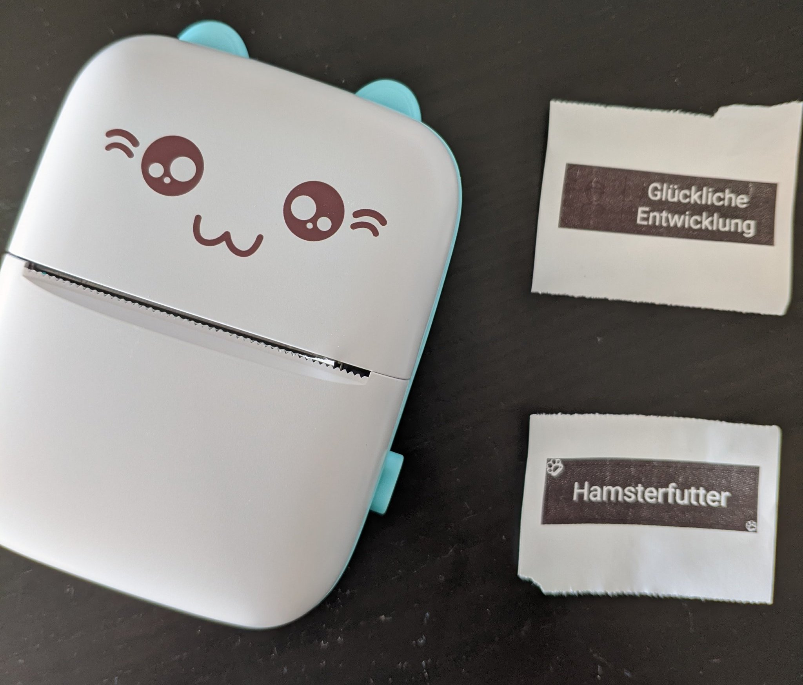

# CatGFX
This library offers a [Adafruit GFX](https://github.com/adafruit/Adafruit-GFX-Library) "driver" for ESP32 and the [cheap](https://s.click.aliexpress.com/e/_AdtGpX) cat ([or rabbit](https://twitter.com/fast_code_r_us/status/1446565079638581249)?) BLE thermal printers like this one:

For usage information have a look examples folder.

If you are looking for support for different printers (or a different micro controllers) you might want to have a look at [this library](https://github.com/bitbank2/Thermal_Printer)

## Information
* [cat printer doc project](https://github.com/JJJollyjim/catprinter)
* [protocol docs](https://github.com/amber-sixel/catprinter/blob/contrib/COMMANDS.md)
